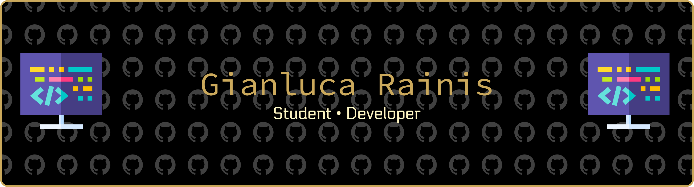

---

## :bulb: About me
I'm a passionate developer with a love for clean code, open source, and continuous learning.  
Always curious about how things work and eager to build tools that solve real problems.

- :telescope: Currently working on: [Z80DevBoard](https://github.com/gianluca-rainis/Z80DevBoard).
- :seedling: Learning more about: Hardware Design with RP2040, Next.js, React.
- :hammer_and_wrench: Favourite programming languages: JavaScript, C, Java
- :sparkles: Ask me about: Web development, Low level programming, Hardware Design

## :toolbox: Development languages

  
## :technologist: Other skills and knowledge

## :hammer_and_wrench: Favourite IDE

## :chart_with_upwards_trend: GitHub Stats

## :handshake: Contacts

